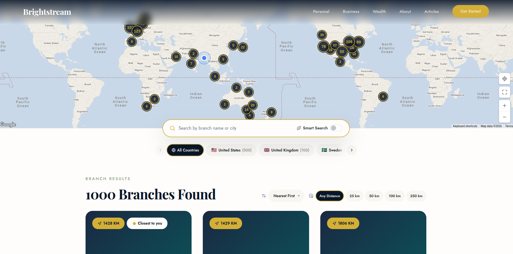

# Brightstream Branch Finder

A location-aware branch finder for Brightstream Bank, powered by Optimizely Graph and Google Maps.

**[Live Demo](https://branch-finder-optimizely-rasel-hasan.vercel.app/)** — `https://branch-finder-optimizely-rasel-hasan.vercel.app`



## Quick Start

**Prerequisites:** Node 18+, pnpm

```bash
git clone https://github.com/raselhasan111/branch-finder-assignment-optimizely.git
cd branch-finder-assignment-optimizely
pnpm install
cp .env.example .env   # then fill in your API keys
pnpm dev               # opens at http://localhost:5173
```

**Environment variables** (`.env`):

- `VITE_GRAPH_AUTH_KEY` — Optimizely Graph single-key auth token
- `VITE_GOOGLE_MAPS_API_KEY` — Google Maps JavaScript API key

Other scripts: `pnpm build`, `pnpm lint`, `pnpm format`

## Approach

1. **API-first research** — Explored the Optimizely Graph schema to understand the `Branch` content type, available fields (coordinates, contact info, address), and query capabilities (`_fulltext` with `fuzzy` matching and `SEMANTIC` ranking). This shaped the entire search architecture.

2. **Hybrid search strategy** — Text queries go server-side via GraphQL for fuzzy/semantic matching. Browse and filter operations (country, distance, sort) run client-side against a cached full dataset. This keeps search quality high while avoiding unnecessary API calls during filtering.

3. **Design system extraction** — Studied the provided HTML mockups to extract Brightstream's visual language: gold (`#d4af37`), midnight navy (`#0a1628`), warm white (`#fefdfb`), Playfair Display for headings, Jost for body text, and rounded component patterns. Applied these consistently so the branch finder feels native to the brand.

4. **Performance-aware map** — Rendered ~1,000 markers imperatively via the Google Maps JS API (not as React components) with `@googlemaps/markerclusterer` to avoid React reconciliation overhead.

5. **Two-layer search debounce** — React 19's `useDeferredValue` keeps the UI responsive while a 300ms custom debounce hook prevents API spam during typing.

## Search & Filter Architecture

```
         User types a query              User browses / filters
                │                                 │
                ▼                                 ▼
   ┌────────────────────────┐      ┌───────────────────────────┐
   │   Optimizely Graph     │      │   Pre-fetched dataset     │
   │   GraphQL API          │      │   1,000 branches cached   │
   │                        │      │   via React Query         │
   │   _fulltext search     │      │                           │
   │   fuzzy · semantic     │      │   10 parallel batches     │
   │   relevance-ranked     │      │   of 100 via Promise.all  │
   └───────────┬────────────┘      └─────────────┬─────────────┘
               │                                 │
               └──────────┬──────────────────────┘
                          ▼
            ┌───────────────────────────┐
            │  Client-side pipeline     │
            │                           │
            │  1. Country filter        │
            │  2. Distance radius (km)  │
            │  3. Sort (relevance ·     │
            │     distance · name)      │
            │  4. Paginate (12/page)    │
            └─────────────┬─────────────┘
                          ▼
               Branch cards + Map view
```

The data path switches automatically: **text queries** hit the server for fuzzy/semantic ranking, while **browse and filter** operations run instantly against the cached full dataset.

## Features

**Core**

- Branch data fetched from Optimizely Graph via GraphQL
- Fuzzy search with optional semantic search toggle
- Fully responsive design (mobile, tab and desktop)
- Brand-matched visual design extracted from Brightstream mockups
- Deployed to Vercel

**Enhanced**

- Interactive Google Maps with dynamic marker clustering
- Browser geolocation with nearest-branch sorting
- Haversine distance calculation displayed on each branch card
- Google Maps directions integration (one-click "Get Directions")
- Branch detail popups with address, phone, email
- Country filter with flag emoji pills and horizontal scroll
- Distance radius filter (25 / 50 / 100 / 250 km)
- Smart sort (relevance, distance, name A-Z)
- Fullscreen map mode with custom zoom controls
- Active filter pills with individual and clear-all removal
- Loading skeletons and error states with retry

## Tech Stack

| Category  | Technology                                          |
| --------- | --------------------------------------------------- |
| Framework | React 19 + TypeScript 5.9                           |
| Build     | Vite 8                                              |
| Styling   | Tailwind CSS v4 + shadcn/ui                         |
| Data      | TanStack React Query, graphql-request               |
| Routing   | TanStack Router                                     |
| Maps      | @react-google-maps/api, @googlemaps/markerclusterer |
| Quality   | ESLint 9, Prettier, Husky + lint-staged             |

## Key Decisions

1. **No state management library** — `useState` + React Context (for geolocation) + React Query (for server state) covers everything needed. Adding Redux or Zustand would be over-engineering for this scope.

2. **Imperative map markers** — Rendering ~1,000 markers as React components causes reconciliation overhead. Using the Maps JS API directly via `useEffect` + refs keeps the map performant.

3. **Parallel batch fetching** — Optimizely Graph caps responses at 100 items. To populate the country filter and enable client-side browsing, 10 batches of 100 are fetched in parallel via `Promise.all`.

4. **Two data paths** — Search queries hit the server API (fuzzy/semantic ranking). Browse and filter operations use the cached full dataset client-side. This balances search quality with filtering speed.

5. **Pre-commit quality gates** — Husky runs Prettier, ESLint, and a full TypeScript + Vite build on every commit. No broken code reaches the repository.

6. **Semantic search as opt-in** — Optimizely Graph's `SEMANTIC` ranking is powerful but can be less precise for exact city or branch names. Keeping it as a user-controlled toggle gives customers the choice.

## Known Limitations

- **No unit/integration tests** — would add Vitest + React Testing Library with more time
- **Google Maps API key required** — the map won't render without a valid key (a placeholder is shown instead)
- **Client-side only** — no SSR, which isn't needed for this use case but noted for completeness
- **Search + filter cap** — when combining a text search with client-side filters, results are limited to the top 100 server matches

## Project Structure

```
src/
  components/
    branches/    # SearchBar, BranchCard, BranchMap, CountryFilter, Pagination, etc.
    layout/      # Navbar, Footer
    ui/          # shadcn/ui primitives (Button, Card, Badge, Input, Switch)
  contexts/      # LocationContext — browser geolocation provider
  hooks/         # useBranches, useAllBranches, useDebounce
  lib/
    graphql/     # GraphQL client setup + query definitions
    filter-branches.ts
    utils.ts     # Haversine distance, cn()
  pages/         # BranchFinder (main page), NotFound
  types/         # Branch interface + type helpers
```
